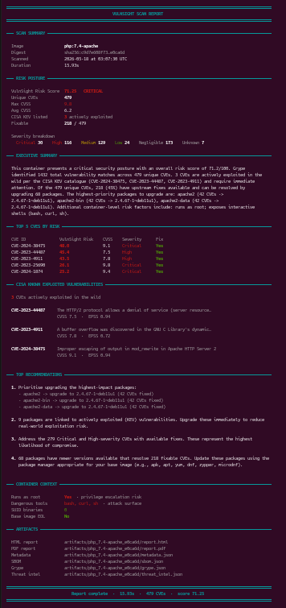
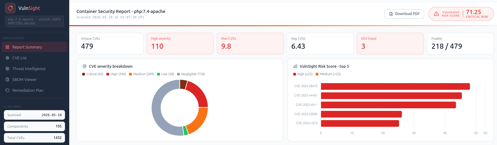
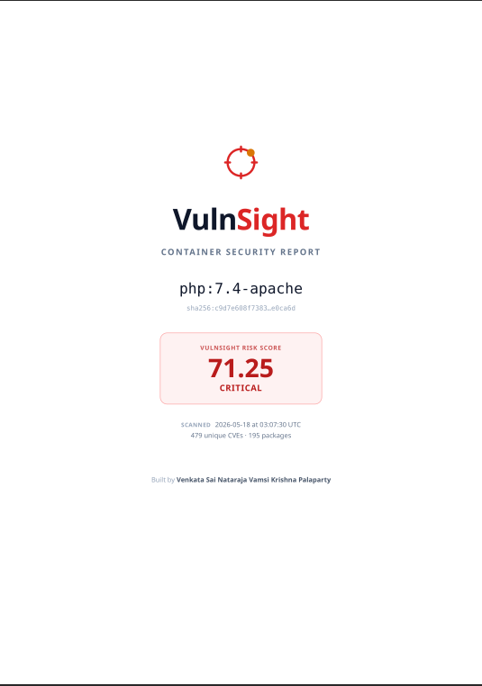

# VulnSight

A Container and Host Vulnerability Scanner with a custom risk scoring engine and threat-intel enrichment.

VulnSight wraps [Syft](https://github.com/anchore/syft) and [Grype](https://github.com/anchore/grype) to generate SBOMs and detect CVEs, then layers on:

- A custom risk scoring methodology that aggregates the top 100 highest-impact CVEs into a normalized 0-100 score
- Threat-intel enrichment from NVD (CVSS, descriptions, CWE), FIRST.org (EPSS exploit probability), and CISA KEV (known-exploited-in-the-wild)
- Container and host context analysis - runs-as-root, dangerous tools, SUID binaries, base image EOL
- HTML and PDF reports

## Example

Scanning a CentOS 6 container:

```
vulnsight -i php:7.4-apache
INFO: Docker mode selected. Resolving image: php:7.4-apache
INFO: Using image digest: sha256:c9d7e608f73832673479770d66aacc8100011ec751d1905ff63fae3fe2e0ca6d
INFO: Running Syft on filesystem: container_fs/php_7.4-apache
Generating SBOM: 100%|█████████████████████████████████████████████████████████████████████████████████████████████████████████████████████████████████████████████████████████████████████████████████████| 1/1 [00:05<00:00,  5.33s/step]
INFO: Deterministic SBOM written to: artifacts/php_7.4-apache_e0ca6d/sbom.json
INFO: Running Grype on SBOM: artifacts/php_7.4-apache_e0ca6d/sbom.json
Running Grype: 100%|███████████████████████████████████████████████████████████████████████████████████████████████████████████████████████████████████████████████████████████████████████████████████████| 1/1 [00:09<00:00,  9.34s/step]
INFO: Grype results written to: artifacts/php_7.4-apache_e0ca6d/grype.json
INFO: Enriching threat intel for 479 CVEs
Enriching CVEs: 100%|██████████████████████████████████████████████████████████████████████████████████████████████████████████████████████████████████████████████████████████████████████████████████| 479/479 [00:00<00:00, 538.89cve/s]
INFO: Threat intel written to: artifacts/php_7.4-apache_e0ca6d/threat_intel.json
INFO: Metadata written to: artifacts/php_7.4-apache_e0ca6d/metadata.json
[+] Loading input files...
INFO: PDF report written to: artifacts/php_7.4-apache_e0ca6d/report.pdf (71.1 KB)
INFO: HTML report written to: artifacts/php_7.4-apache_e0ca6d/report.html
INFO: 
=== Timing Summary ===
INFO: sbom_seconds: 5.3345s
INFO: grype_seconds: 9.3392s
INFO: threat_intel_seconds: 0.8892s
INFO: Total Scan Time: 15.9286s

══════════════════════════════════════════════════════════════════════════════════════════════════════════════
                                            VULNSIGHT SCAN REPORT
══════════════════════════════════════════════════════════════════════════════════════════════════════════════

─── SCAN SUMMARY ─────────────────────────────────────────────────────────────────────────────────────────────

  Image                 php:7.4-apache
  Digest                sha256:c9d7e608f73…e0ca6d
  Scanned               2026-05-18 at 03:07:30 UTC
  Duration              15.93s

─── RISK POSTURE ─────────────────────────────────────────────────────────────────────────────────────────────

  VulnSight Risk Score  71.25   CRITICAL
  Unique CVEs           479
  Max CVSS              9.8
  Avg CVSS              6.2
  CISA KEV listed       3 actively exploited
  Fixable               218 / 479

  Severity breakdown
    Critical 30    High 116    Medium 129    Low 24    Negligible 173    Unknown 7

```

The full HTML and PDF reports land in `artifacts/<image>_<digest>/`.





📄 **[Download the full PDF report](./docs/VulnSight_php7.4-apache_report.pdf)** to see the complete multi-page output.

## Why I built it

**At Zscaler, I worked on vulnerability scanning of cloud instances and container images across AWS, GCP, and Azure, using Trivy and Grype. The problem I kept running into: both tools just output a wall of CVEs and call the job done. That's when I realized the hard part isn't finding vulnerabilities - it's deciding which ones actually matter for a given workload. VulnSight is my attempt at that second half: take Grype's output and turn it into a prioritized, defensible answer to "what do I actually fix first?"**

## Quick start

### Requirements

- Python 3.10+
- Docker (for `--image` mode)
- [Syft](https://github.com/anchore/syft#installation) and [Grype](https://github.com/anchore/grype#installation) on `$PATH`
- Pango for PDF generation (Linux only):

  ```
  Debian/Ubuntu:  sudo apt install libpango-1.0-0 libpangoft2-1.0-0
  Fedora/RHEL:    sudo dnf install pango
  Alpine:         apk add pango
  ```

### Install

```bash
git clone https://github.com/vsnvamsikrishnapalaparty/vulnsight.git
cd vulnsight
python3 -m venv .venv
source .venv/bin/activate
pip install -r requirements.txt

cp .env.example .env
# Add your NVD API key (free: https://nvd.nist.gov/developers/request-an-api-key)
```

### Run

```bash
# Scan a Docker image
vulnsight -i php:7.4-apache

# Scan a tarball
vulnsight -i ./myimage.tar

# Scan a host filesystem (e.g. an EC2 instance, on-prem server)
vulnsight --root-path /
```

## Risk scoring methodology

The VulnSight score (0-100) aggregates the top 100 highest-risk CVEs from a scan. Each CVE contributes a weighted sum of:

| Factor           | Source             | What it captures                                          |
|------------------|--------------------|-----------------------------------------------------------|
| CVSS base score  | NVD                | Baseline severity (industry standard)                     |
| EPSS             | FIRST.org          | Predicted probability of exploitation in the next 30 days |
| KEV listing      | CISA               | Whether it's actively exploited in the wild               |
| Age              | NVD published date | Risk accumulated over time without patching               |
| Severity tier    | Grype              | Distro-specific classification                            |
| CWE category     | NVD                | Weakness type, weighted by exploitability                 |
| Fix availability | Grype              | Whether an upstream fix exists (actionable work)          |

Container/host context further adjusts the score: running as root, end-of-life base images, SUID binaries, and exposed shells all raise the final number.

Risk tiers: **0-19 LOW**, **20-39 MEDIUM**, **40-69 HIGH**, **70+ CRITICAL**.

- **I chose top-100 aggregation over averaging across all CVEs because outliers would otherwise be diluted on large images like centos:6 with 1000+ CVEs.**

## Architecture

Pipeline stages, in order:

1. **Image resolution** - pull a Docker image, extract the rootfs, or read a tarball / host path
2. **SBOM generation** - via Syft
3. **Vulnerability detection** - via Grype against the SBOM
4. **Threat-intel enrichment** - NVD, EPSS, CISA KEV (with disk-cached results, parallel NVD fetches, EPSS bulk batching)
5. **Risk scoring** - aggregate the per-CVE contributions, factor in container/host context
6. **Report generation** - HTML (interactive, with embedded PDF) and PDF (print-optimized)
7. **CLI summary** - styled terminal report printed at the end of each scan

```
vulnsight/
├── assets
│   └── logo
│       ├── LOGO.md
│       ├── vulnsight-favicon.svg
│       ├── vulnsight-logo-dark.svg
│       ├── vulnsight-logo-light.svg
│       └── vulnsight-logomark.svg
├── container_context.py
├── filesystem_provider.py
├── grype.py
├── image_resolver.py
├── metadata.py
├── report_generator
│   ├── __init__.py
│   └── report_pipeline.py
├── risk_engine
│   ├── risk_config.json
│   └── risk_engine.py
├── sbom_generator.py
├── scan_engine.py
├── scanner.py
├── threat_intel
│   ├── benchmark_threat_intel.py
│   ├── cache.py
│   ├── cve_info.py
│   ├── diagnose_threat_intel.py
│   ├── epss.py
│   ├── __init__.py
│   ├── kev.py
│   ├── nvd.py
│   ├── test_threat_intel.py
│   └── threat_sources.py
└── utils
    ├── cli_summary.py
    ├── dependency_checker.py
    ├── __init__.py
    └── summary.py
```

## Caching

Threat intel responses (NVD, EPSS, KEV) are cached on disk under `cache/` to avoid hitting upstream APIs on every scan. Cache TTLs:

| Source | TTL | Why                                                           |
|--------|-----|---------------------------------------------------------------|
| KEV    | 24h | CISA updates the catalog daily                                |
| EPSS   | 24h | FIRST.org refreshes scores daily                              |
| NVD    | 12h | CVE descriptions and CVSS scores rarely change once published |

A cold first scan of a large image (1000+ CVEs) takes 5-10 minutes because NVD rate-limits authenticated requests to roughly 1.85/sec. Subsequent scans of the same image are sub-second; cross-image scans share cache hits whenever CVEs overlap.

## Known limitations

- **Cold-cache scans of high-CVE-count images are slow.** First scan of an image with ~1000 CVEs takes 5-10 minutes due to NVD's rate limit (~1.85 requests/sec even with an API key). Pre-warming the cache against common base images is the recommended workaround.

- **STIG / SCAP configuration auditing is not implemented.** Vulnerability detection (CVE-based) and configuration compliance (e.g., DISA STIG) are distinct domains; VulnSight currently covers the former.

## Roadmap

- **Local NVD feed caching** to eliminate per-CVE API rate limits, via the [Fraunhofer FKIE community feed reconstruction](https://github.com/fkie-cad/nvd-json-data-feeds), refreshed every 2 hours
- **STIG / SCAP compliance scanning** via OpenSCAP integration, layered alongside CVE findings
- **CVE deduplication across base layers** - detect when a child image inherits CVEs from its base and group findings accordingly

## License

MIT. See [LICENSE](./LICENSE).

## Author

Venkata Sai Nataraja Vamsi Krishna Palaparty
- Master's in Cybersecurity, Northeastern University
- Previously at Zscaler
- LinkedIn: https://www.linkedin.com/in/vsnvamsikrishnapalaparty/
- Email: vsnvamsikrishna.palaparty@gmail.com
